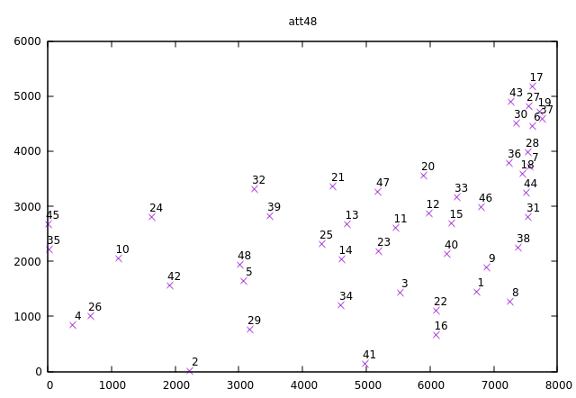
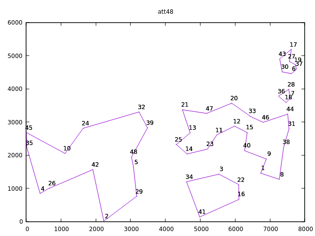
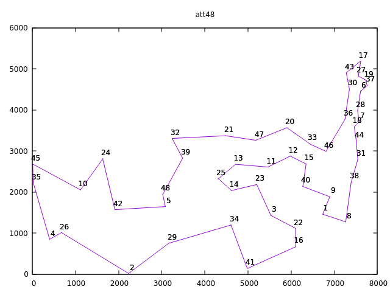

# ro2

Operations Research Homeworks.

University of Padova - Department of Information Engineering (DEI).

## Motivation

Implementing a TSP solver for the "operations research 2" class, a.y. 2019-2020.

## Requirements

To build and run this project you'll need IBM ILOG CPLEX installed on your system.

## Build

```sh
make check  # Ensure library paths are correct
make all    # Build the project
make clean  # Delete build files
```

By default, the project binary will be in `./bin/tsp`.

## Usage

As simple as

```sh
Usage: tsp [-?V] [-M MODEL] [--model=MODEL] [--noplot] [--help] [--usage]
            [--version] TSP_FILE
```

More options are available. Give it a `tsp --help`.

```txt
Usage: tsp [OPTION...] TSP_FILE
Solve a Traveling Salesman Problem instance.

  -c, --cutup=VALUE          Upper cutoff. Default: don't cut.
  -e, --epgap=EPGAP          Relative MIP gap tolerance.
  -h, --heurtime=SECONDS     Heuristic time limit. Default: 10min.
  -j, --threads[=N]          Global thread count. Default ALL.
  -m, --memory=SIZE          Maximum working memory (size in MB).
  -M, --model=MODEL          Solving technique. Available: Random, Dummy, MTZ,
                             Flow1, LazyMTZ, LazyFlow1, Loop, LoopF, LoopM,
                             LoopX, Legacy, Generic LegacyConcorde,
                             GenericConcorde, LegacyConcordeShallow,
                             GenericConcordeShallow, LegacyConcordeRand,
                             GenericConcordeRand, HeurHardfix,
                             HeurLocalBranching, HeurNearestNeighbor,
                             HeurGRASP. Default: Generic.
  -n, --nodelimit=NODES      MIP node limit.
      --name=TSPNAME         Name to assign to this problem.
      --noplot               Do not sketch the solution.
      --scrind               Display CPLEX messages on screen.
  -s, --seed=RNDSEED         Random seed.
  -t, --timelimit=SECONDS    Optimizer time limit in seconds.
      --verbose, --debug, --trace, --quiet
                             Set program logging level.
  -?, --help                 Give this help list
      --usage                Give a short usage message
  -V, --version              Print program version

Mandatory or optional arguments to long options are also mandatory or optional
for any corresponding short options.

Report bugs to {marco.cieno, francesco.cazzaro}@studenti.unipd.it.
```

Sample files are provided in folder `data` and come courtesy of the [TSPLIB](http://comopt.ifi.uni-heidelberg.de/software/TSPLIB95/).

Available models are:

- `Random`
- `Dummy`
- `MTZ`
- `Flow1`
- `LazyMTZ`
- `LazyFlow1`
- `Loop`
- `LoopF`
- `LoopM`
- `LoopX`
- `Legacy`
- `Generic`
- `LegacyConcorde`
- `GenericConcorde`
- `LegacyConcordeShallow`
- `GenericConcordeShallow`
- `LegacyConcordeRand`
- `GenericConcordeRand`

Available heuristics are:

- `HeurHardfix`
- `HeurLocalBranching`
- `HeurNearestNeighbor`
- `HeurGRASP`

Default model is `Generic`, i.e., branch and cut model with generic "candidate cut" callback.

Here's an example, just for fun:

```sh
tsp data/att48.tsp --model=Dummy
```




Obviously, that's not a valid solution, here's one:

```sh
tsp data/att48.tsp --model=LazyFlow1
```


